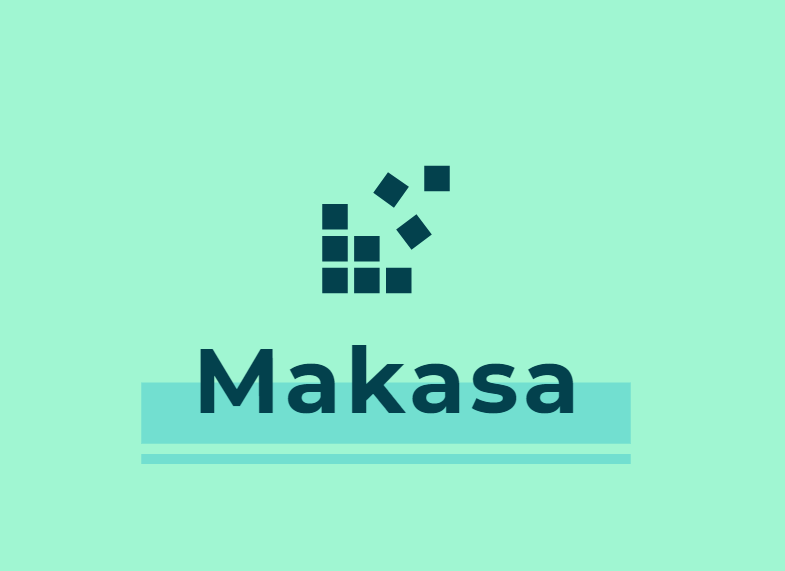
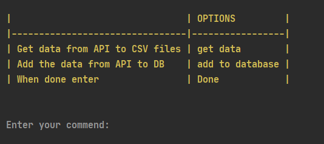
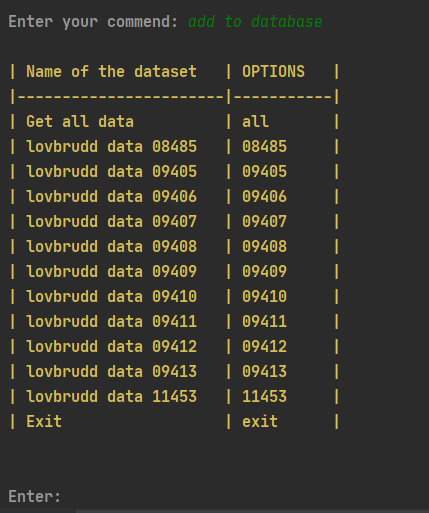

  

***Skrevet av Kaja, Martin og Salam
dato: 23.10.2020***

## Mappe struktur:

**DL** -> Deep learing kode  

**ML** -> Machine learing kode

**PowerBI** -> visualiseringer 

**Starschema_sosial** -> sql kode for star schema for sosiale veriabler 

**dash_visualization** -> dash visualisering

**database** -> volum for postgres i docker

**databaseconnection** -> kobler til og sende data fra api til databasen (gp_makasa)

**sql** -> sql koden for ETL delen

**google colab** -> koden vi brukte for ML og DL i colab

**text_documents** -> er beskrivelse av dataen vi hentet fra API

**main.py** -> programmet som gir deg mulighet til å laste ned dataen i CSV og legge til dataen til databasen.

**requirements.txt** -> er beskrivelse av alle pakkene og dens versjon vi har brukt i prosjektet. 

**presentasjon** -> er avsluttingspresentasjon vi hadde på fredag 23.10.2020

# Bruke programmet

- install requirements.txt
>>> pip install -r requirements.txt

For nedlasting av data start programmet main.py. 
>>> python main.py

## starte programmet

  

## legge til data til databasen

  

